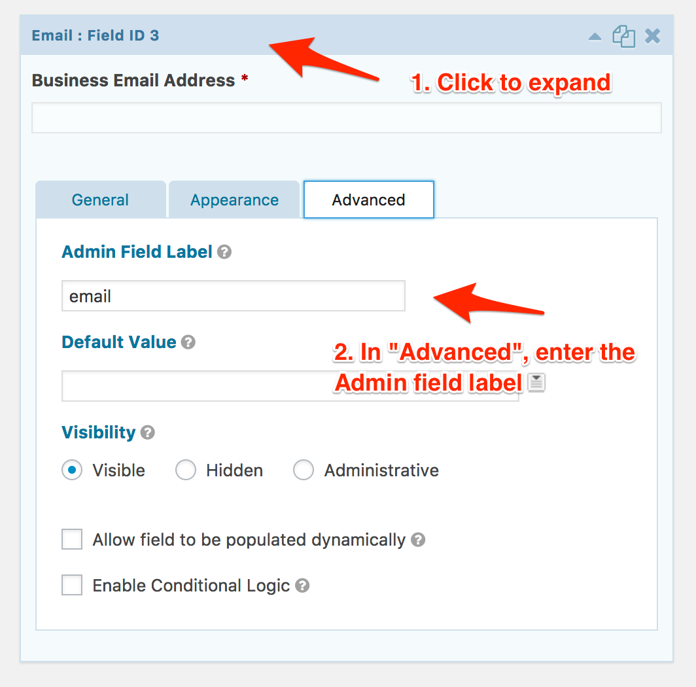

# Store Gravity Forms submissions as User Attributes with Segment

In this recipe, we'll show you how to setup your wordpress site using Gravity Forms
to send form submissions to [Hull])(https://www.hull.io) through [Segment](https://segment.com).

It assumes you have a working Segment setup, with their client-side library [analytics.js](https://segment.com/docs/sources/website/analytics.js/quickstart/) installed and properly configured.

Once you ensured this, follow the steps below:

- [Download this Wordpress Plugin](https://github.com/hull/gravity_forms_capture/archive/master.zip), and activate it.
- Go to your [Hull dashboard](https://dashboard.hullapp.io). Ensure in Settings > User Authentication > Login Options that `Guest Users` are active, Save.
- Go to the Connectors Section, Install a **Processor** connector and paste the script below.
- Install the **Segment** connector and set up segment to send data to Hull.

```javascript
//Loop over all events we received in that batch
_.map(events, (event)=>{
  //Extract Event properties and Name;
  const { properties, event: name } = event;
  //Early return if no properties or name is not something we capture
  if (!properties || name.toLowerCase()!=="form submitted") return;
  //Get Submitted form name
  const { form_name, email } = event.properties;
  //Store Attributes in group with that name
  traits(event.properties, { source: form_name });
  //Also store email at top level if we discover it.
  if (email) traits({ email }); 
});
```


### Optional Step (recommended)

Setup a custom attribute name for each field in the forms to something more manageable than the full question text.

For instance instead of "Your business email", you might want to store the answer as "email".

To do this, you need to go to each question's "Advanced" tab and fill in the `Admin Field Label`


